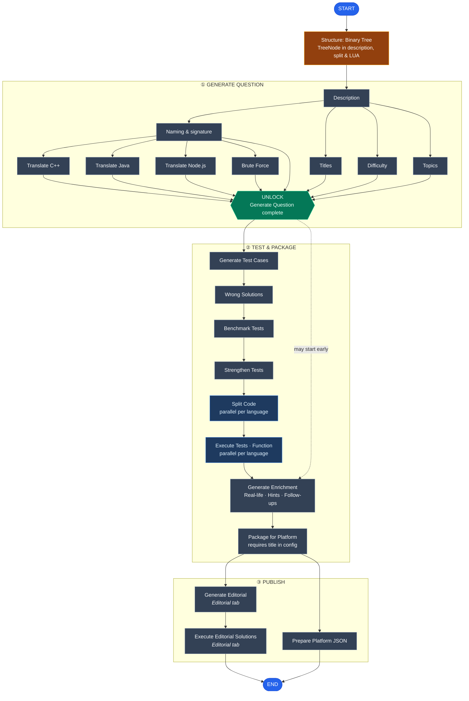
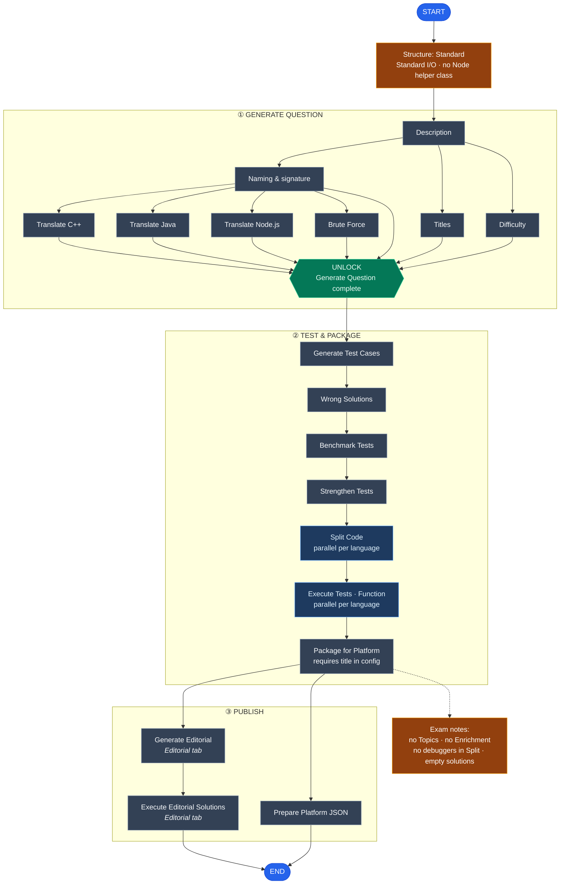
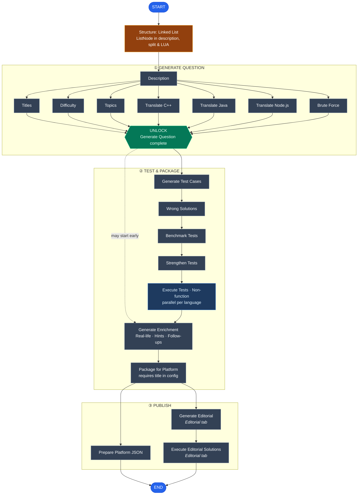
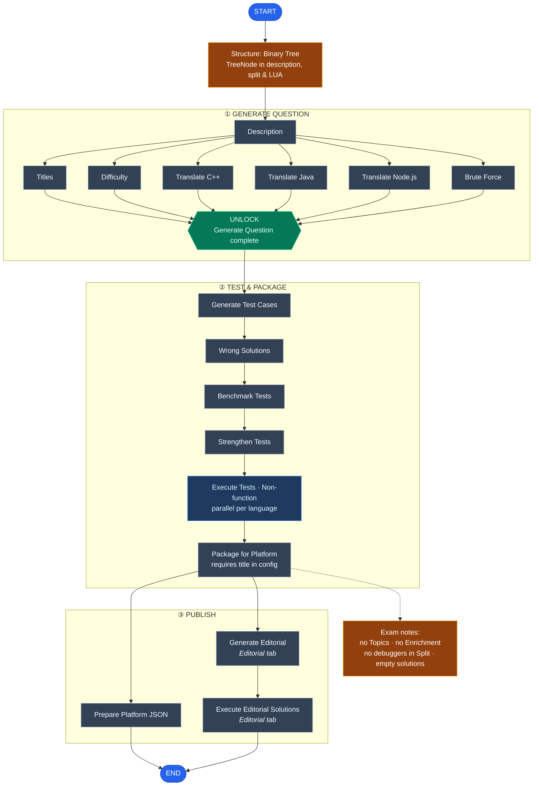

# Pipeline flow diagrams

Top-to-bottom flow diagrams matching the **Clear Picture** pipeline (wave graph + per-language Split/Execute).

Open Markdown Preview in Cursor to render:

- Mac: `Cmd+Shift+V` · Windows/Linux: `Ctrl+Shift+V`

Regenerate: `node docs/pipeline-flows/build-flows.mjs`

## How to read

| Shape | Meaning |
|-------|---------|
| Rounded `START` / `END` | Entry and exit |
| Rectangles | Pipeline steps |
| Blue rectangles | Split / Execute — one parallel run per enabled language |
| Green diamond | Gate — Generate Question (all waves + Brute Force) must finish |
| Dashed arrow | Optional early start (Enrichment after GQ in practice) |
| `A & B & C` branches | Parallel steps within a wave |

## Pipeline configuration (global)

| Control | Effect |
|---------|--------|
| **Languages** | Filters translate, split, execute, LUA, and JSON to selected langs only |
| **Title (short text)** | Required before Package / JSON; overwrites `Outputs/generated_titles.txt` on Save |
| **Generate title with AI** | When enabled, Titles sub-step runs LLM; otherwise manual title is used (shown as *skipped*) |
| **Test case count** | Passed to testcase generation |
| **Default tag names** | One tag per line; used in platform JSON when set |

Sub-steps (naming, difficulty, topics, translations) are **derived** from question type + mode + languages — not toggled individually in config.

## Generate Question waves

| Variant | Wave 1 (after Description) | Wave 2 |
|---------|---------------------------|--------|
| Function | Naming, Titles, Difficulty, Topics (practice) | Translate enabled langs + Brute Force (after Naming) |
| Non-function | Titles, Difficulty, Topics (practice) | Translate enabled langs + Brute Force (after Description) |
| Exam (both) | No Topics sub-step | Same wave 2 layout |

Brute Force is embedded in the GQ graph (wave 2), not a separate linear step in Run all.

## All flows

Grouped by question type and mode; each group has all three structure types (Standard, Linked List, Binary Tree).

### Function-based · Practice

- [Standard](#standard-function-practice)
- [Linked List](#linked-list-function-practice)
- [Binary Tree](#binary-tree-function-practice)

### Function-based · Exam

- [Standard](#standard-function-exam)
- [Linked List](#linked-list-function-exam)
- [Binary Tree](#binary-tree-function-exam)

### Non-function-based · Practice

- [Standard](#standard-nonfunction-practice)
- [Linked List](#linked-list-nonfunction-practice)
- [Binary Tree](#binary-tree-nonfunction-practice)

### Non-function-based · Exam

- [Standard](#standard-nonfunction-exam)
- [Linked List](#linked-list-nonfunction-exam)
- [Binary Tree](#binary-tree-nonfunction-exam)

---

## Function-based · Practice

### Standard

### Linked List

### Binary Tree

---

## Function-based · Exam

### Standard

### Linked List

### Binary Tree

---

## Non-function-based · Practice

### Standard

### Linked List

### Binary Tree

---

## Non-function-based · Exam

### Standard

### Linked List

### Binary Tree

---
