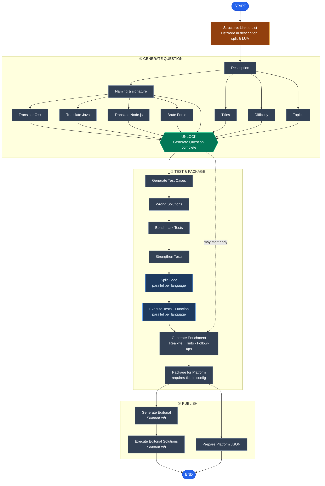

# Linked List · Function-based · Practice

Open **Markdown Preview** (`Cmd+Shift+V` / `Ctrl+Shift+V`) to view the flow diagram.

```mermaid
flowchart TB
    START(["START"])
    END(["END"])

    STRUCT["Structure: Linked List<br/>ListNode in description, split & LUA"]
    GQ_GATE{{"UNLOCK<br/>Generate Question complete"}}

    START --> STRUCT --> DESC["Description"]

    subgraph GQ["① GENERATE QUESTION"]
      direction TB
      NAMING["Naming & signature"]
      TITLES["Titles"]
      DIFF["Difficulty"]
      TOPICS["Topics"]
      DESC --> NAMING & TITLES & DIFF & TOPICS
      CPP["Translate C++"]
      JAVA["Translate Java"]
      NODEJS["Translate Node.js"]
      BF["Brute Force"]
      NAMING --> CPP & JAVA & NODEJS & BF
      NAMING & TITLES & DIFF & TOPICS & CPP & JAVA & NODEJS & BF --> GQ_GATE
    end

    subgraph MAIN["② TEST & PACKAGE"]
      direction TB
      TC["Generate Test Cases"]
      WRONG["Wrong Solutions"]
      BENCH["Benchmark Tests"]
      HARDEN["Strengthen Tests"]

      GQ_GATE --> TC --> WRONG --> BENCH --> HARDEN
      HARDEN --> SPLIT["Split Code<br/>parallel per language"]
      SPLIT --> EXEC["Execute Tests · Function<br/>parallel per language"]
      
      ENRICH["Generate Enrichment<br/>Real-life · Hints · Follow-ups"]
      GQ_GATE -.->|"may start early"| ENRICH
      EXEC --> ENRICH --> PKG["Package for Platform<br/>requires title in config"]
    end

    subgraph FINISH["③ PUBLISH"]
      direction TB
      ED["Generate Editorial<br/><i>Editorial tab</i>"]
      JSON["Prepare Platform JSON"]
      EXEC_ED["Execute Editorial Solutions<br/><i>Editorial tab</i>"]

      PKG --> ED & JSON
      ED --> EXEC_ED
    end
    

    JSON --> END
    EXEC_ED --> END

    classDef startEnd fill:#2563eb,stroke:#1d4ed8,color:#fff
    classDef note fill:#92400e,stroke:#f59e0b,color:#fff
    classDef step fill:#334155,stroke:#94a3b8,color:#f8fafc
    classDef gate fill:#047857,stroke:#34d399,color:#ecfdf5
    classDef parallel fill:#1e3a5f,stroke:#60a5fa,color:#e0f2fe

    class START,END startEnd
    class STRUCT note
    
    class DESC,NAMING,TITLES,DIFF,TOPICS,CPP,JAVA,NODEJS,BF,TC,WRONG,BENCH,HARDEN,ENRICH,PKG,ED,JSON,EXEC_ED step
    class SPLIT,EXEC parallel
    class GQ_GATE gate
```
