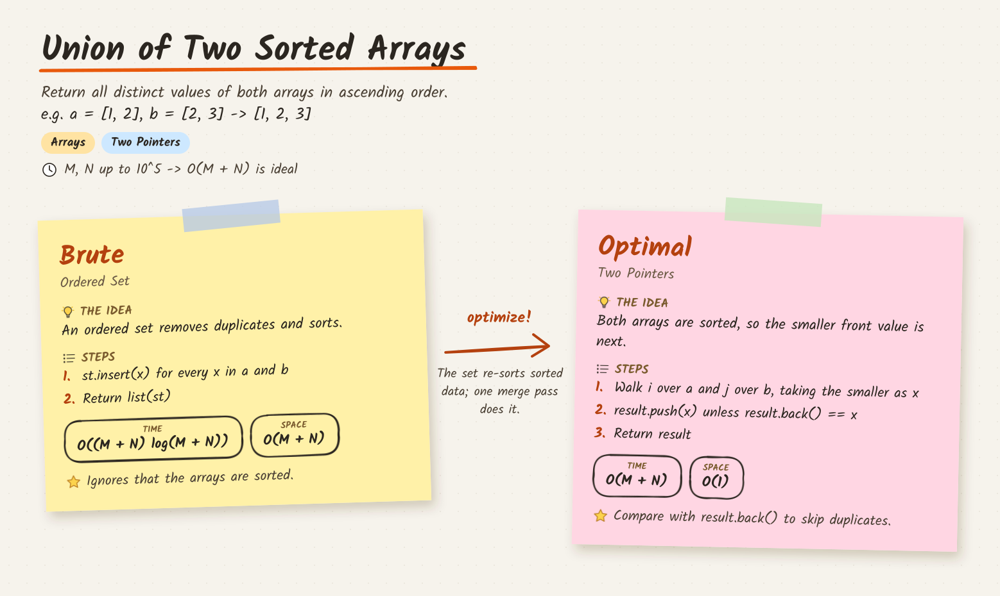
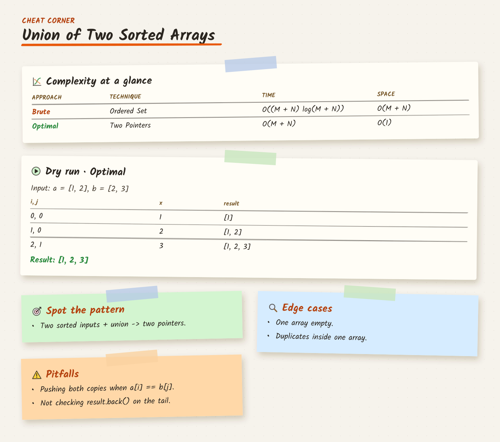

# Revision Notes Image — Build Plan

**Status:** v1 implemented on branch `vishvjeet` (see [Implemented in v1](#implemented-in-v1)).
The rest of this document is the original plan, kept for context.
**Date:** 2026-09-25

## Implemented in v1

**Design: sticky notes** (chosen from four prototypes; the original TUF-style table was
dropped). Output for the sample problem (`src/lib/revision-notes/sample-notes.json`):

| Page 1 · Approaches | Page 2 · Cheat corner |
|---|---|
|  |  |

- **Page 1:** title, one-liner, example, topic tags and a constraints hint, then one tilted
  sticky note per editorial solution, in the editorial's order: the idea, numbered code steps, TIME and
  SPACE stamps, and a "remember" line. An **optimize!** arrow between notes says why the next
  approach is faster.
- **Page 2 (cheat corner):** complexity at a glance, a dry run of the optimal approach on the
  example, and notes for spotting the pattern, edge cases and pitfalls. It is only drawn when
  there is something to put on it.

**How to use:** Problem page → **Editorial** tab → **Revision Notes** card →
**Generate Revision Notes** (needs a finished editorial). Then:
- **View:** switch pages, zoom, rotate, download a page.
- **Download:** saves every page.
- **Edit:** change any field, **Preview** all pages, **Save** (no LLM call).
- **Refine:** regenerate with an instruction.

A warning appears if the editorial was regenerated after the notes were made.

**Defaults** (easy to change later): every editorial solution gets a note (3 per page), no logo,
internal review tool only (not in `coding_questions.json`).

**Safety check** (runs inside Generate; **Verify Revision Notes** re-runs it on demand):

1. **12 deterministic checks** re-verify the saved notes against the editorial:
   - one note per solution, in order
   - names, TC/SC and labels match the editorial
   - pseudocode and prose use only the editorial's names
   - the dry run traces the last solution with its variables, and its result matches the
     example's output
   - no empty sections, the text fits, and the title matches

   All pages are drawn from this one checked JSON, so the images always agree with each other.
2. **An independent LLM review** by a different model family (`revision_audit` = Gemini 3.1
   Pro; the generator is GPT-5.4) checks what code can't:
   - each note is faithful to its editorial solution
   - the short pseudocode behaves like the editorial's
   - it re-traces the dry run row by row
   - the example, one-liner, constraints hint, edge cases, pitfalls and pattern cues are
     correct

   Findings come back as `error` or `warning`, each with a field path and a fix.
3. **Auto-repair:** on any error, the notes are regenerated **once** with the findings fed
   back, then re-checked. The repair is kept unless it made things worse.
4. **Report:** the result is saved in the notes (`audit`) and shown on the Editorial tab as
   **Verified**, **Verified with warnings**, **Needs review** or **Not verified**, with the
   full report. Saving an edit marks the report out of date. **Re-verify** re-checks the
   edited notes; it reports but never rewrites them. If the reviewer can't run, the notes
   show **Needs review**, never **Verified**.

**Where the code lives:**

| Piece | File |
|---|---|
| Pipeline step (LLM → JSON, validation, one retry) | `pipeline/Scripts/revision_notes_manager.py` |
| Prompt | `pipeline/Scripts/Prompts/revisionNotesPrompt.py` |
| Safety check (deterministic checks, independent review, Verify step) | `pipeline/Scripts/revision_notes_audit.py`, `Prompts/revisionNotesAuditPrompt.py` |
| LLM purpose `revision_notes` (GPT-5.4, low effort; override `OPENROUTER_MODEL_REVISION_NOTES`) | `pipeline/Scripts/llm_client.py` |
| Data contract (v2, still reads v1) + page list | `src/lib/revision-notes/types.ts` |
| Text measuring / wrapping (real font widths) | `src/lib/revision-notes/measure.ts` |
| Board layout → positioned "scene" per page | `src/lib/revision-notes/board.ts` |
| Hand-drawn strokes | `src/lib/revision-notes/sketch.ts` |
| Painter + icons (Satori JSX) | `src/lib/revision-notes/StickyBoard.tsx`, `icons.tsx` |
| PNG render (`next/og`, fonts from disk) | `src/lib/revision-notes/render.tsx` |
| API: `GET ?page=N` (`&download=1`), `POST ?page=N` preview of unsaved notes | `src/app/api/problems/[id]/revision-notes/image/route.ts` |
| Editorial-tab UI (thumbnails, viewer, editor) | `src/components/problems/RevisionNotesPanel.tsx` |
| Step registration | `src/lib/pipeline-config.ts`, `src/types/pipeline.ts`, `src/lib/pipeline-dependents.ts` |

**How it works:**
- **Faithful to the editorial, by program, not by prompt:**
  - **One note per editorial solution,** in the editorial's order. A reply that skips,
    reorders or invents a solution fails the check.
  - **Name, TC and SC are copied from the editorial by the script:** the solution heading
    and the backticked values in Complexity Analysis.
  - **Code steps instead of pseudocode:** each note shows 2–5 numbered STEPS: short revision
    cues (at most 70 characters, verb first, key variables only, no loop mechanics), written
    from that solution's editorial pseudocode. The brute force prefers 2–4. The LLM is handed
    the pseudocode with comments already removed. For each note:
    1. **Name check:** every code name in a step (`seen_subsets`, `awarded[i]`,
       `push_back()`) must appear in *that solution's* editorial pseudocode.
    2. **Limits:** 2–5 steps, each at most 70 characters.
    3. **Faithfulness check:** the independent reviewer model confirms the steps capture the
       key steps and every correctness check (validity, duplicate, edge conditions), and say
       nothing wrong. Leaving out loop mechanics is expected.
    4. **Retry:** any failure gets a focused per-solution rewrite, up to 3 tries, with the
       problems fed back. The repair round never regenerates steps that already passed.
    5. **Old notes** with pseudocode still render (HOW + CODE) until regenerated.
  - **Labels** (Brute / Better / Optimal) are assigned from position and TC.
  - **Variable names in prose** (and in dry-run columns) are checked against the
    editorial's code. A name that isn't there (e.g. `ans` where the editorial says
    `result`) triggers the retry.
  - **More than 3 solutions** spill onto extra approach pages (3 notes per page, balanced).
    The "optimize!" arrow carries over the page break.
- **The LLM only writes prose:** the idea, how, remember, why-better and the cheat corner.
  It never draws anything.
- **Validation before saving:** structure, length limits, TC/SC against the editorial's
  complexity section, whether the dry-run rows match its columns, and whether the dry-run
  result matches the example's output. Any problem triggers one retry with the problems fed
  back. After that, only a broken structure fails the step. Anything else is a warning, and
  a malformed dry run is dropped.
- **Exact sizing:** pages are drawn on request from `revision_notes.json` (milliseconds; not
  stored). Text is wrapped using the font's real character widths (`kalam-metrics.json`), so
  every element has an exact position and nothing gets clipped.
- **Font:** Kalam (OFL), cut down to Latin plus math symbols. Characters it lacks are swapped
  for ASCII: `→` becomes `->`, `10⁵` becomes `10^5`, `Σ` becomes `sigma`.
- **Pipeline:** the step lives on the Editorial tab and is **not** part of Run All. It never
  changes a problem's completed status.

**Preview the design locally** (no app, no LLM):

```
npx tsx scripts/render-revision-notes.tsx [notes.json] [out-prefix]   # writes <prefix>_p1.png, _p2.png
```

**Tests:** `pipeline/Scripts/tests/test_revision_notes.py` (validator, v2 fields),
`pipeline/Scripts/tests/test_revision_notes_audit.py` (safety check, repair round, Verify step) and
`src/lib/revision-notes/board.test.ts` (wrapping, parsing, page layout).

---

## What we're building

takeUforward (Striver's A2Z sheet) editorials have a **"Revision notes image"**: a single
handwritten-style cheat sheet per problem that compresses the whole editorial into one table.
Clicking it opens a viewer with zoom, rotate and download.

*(Reference: the "Revision notes image" on any takeUforward A2Z editorial.)*

What the sheet contains:

| Part | Content |
|---|---|
| Header card | Problem title, a one-line statement, one tiny example (`input → output`) |
| Columns | One per approach (TUF shows Brute and Optimal), each with its own pastel colour |
| Rows | 💡 Intuition · 🔍 Approach · `</>` Pseudocode · 🕐 TC · 📦 SC · ⭐ Key takeaway |
| Style | Handwriting font, paper texture, hand-drawn borders, brand logo in the corner |

We want the same thing generated automatically from the editorial our pipeline already produces.

**Final output: a PNG image that looks like handwritten short notes**, as in the reference
above. It should be downloadable and viewable in the editorial. The handwritten look comes from:

- a handwriting font (Kalam, Caveat or Patrick Hand) for all text, including pseudocode
- slightly wobbly, hand-drawn-style table borders and underlines, drawn as SVG paths
- sketch-style icons (bulb, magnifier, clock, cube, star)
- a warm paper-texture background and pastel column fills

## Approach

```
editorial.md ──► [LLM summarise] ──► revision_notes.json ──► [render template] ──► revision_notes.png
  (existing)       new Python step       structured text        Next.js next/og        object storage
```

The two stages are deliberately separate:

- **The LLM writes only short text.** It never draws.
- **The image comes from a fixed template.** Code, pseudocode and complexity such as
  `O((M + N) log(M + N))` render exactly as written, and every problem looks the same.

We are **not** using an AI image model for the picture. Image models often garble code and
Big-O notation, and a wrong complexity on a revision sheet is worse than no sheet.

## Phase 1 — Summarise the editorial into JSON (Python)

**New script:** `pipeline/Scripts/revision_notes_manager.py`, following the pattern of
`editorial_manager.py`:

- Reads `Outputs/editorial.md` and the short title (reuses `resolve_short_title`).
- Calls `call_llm` and records usage with
  `track_usage(..., step_id="generate_revision_notes")`, so the costs page keeps working.
- Writes `Outputs/revision_notes.json`.

**New prompt:** `pipeline/Scripts/Prompts/revisionNotesPrompt.py`. It asks for strict JSON:

```json
{
  "title": "Union of Two Sorted Arrays",
  "oneLiner": "Return all distinct values present in either sorted array, in ascending order.",
  "example": "a = [1, 2, 3, 4, 5], b = [1, 2, 7] → [1, 2, 3, 4, 5, 7]",
  "approaches": [
    {
      "label": "Brute",
      "intuition": "An ordered set removes duplicates and automatically produces ascending values.",
      "approach": "Insert every value from both arrays into an ordered set, then copy the set into the result.",
      "pseudocode": "s = ordered_set()\nfor x in a: s.insert(x)\n...",
      "tc": "O((M + N) log(M + N))",
      "sc": "O(M + N)",
      "takeaway": "Set operations ignore the arrays' sorted advantage."
    }
  ]
}
```

**Validation (in Python, before writing):**

- The output must parse as JSON with every required field.
- Length limits per field keep the sheet readable (for example intuition ≤ 140 chars,
  approach ≤ 220 chars, pseudocode ≤ 8 lines, takeaway ≤ 80 chars).
- `tc`/`sc` must match the Complexity Analysis section of `editorial.md`.
- On failure: retry once with the error fed back, then fail the step with a clear message.

**Tests:** a unittest for the validator under `pipeline/Scripts/tests/`, run by `npm run test:json`.

## Phase 2 — Render the image (Next.js)

**Renderer:** Next's built-in `ImageResponse` from `next/og` (Satori + Resvg). It turns JSX
into a PNG, needs no new dependency and **no headless Chromium**. That matters because we
deploy a slim Docker image on Render's free plan.

**Template:** `src/lib/revision-notes/RevisionSheet.tsx`

- Header card: title (underlined), one-liner, example.
- One column per approach with its own pastel colour.
- Rows: Intuition, Approach, Pseudocode, TC, SC, Takeaway, each with an icon.
- Handwriting font (Kalam or Caveat, `.ttf`), paper-tone background, logo in the corner.

**Renderer limitations to design around** (from the Next.js 16 `ImageResponse` docs):

- Flexbox only, no CSS grid, so the table is built from flex rows.
- The render bundle (JSX, fonts, images) must stay under **500 KB**.
- Only `ttf` / `otf` / `woff` fonts.
- The image height must be given up front, so we calculate it from the number of pseudocode
  lines and the text lengths.

**Route:** `src/app/api/problems/[id]/revision-notes/route.ts`

- Uses the existing ownership check from `src/lib/auth/*`.
- Reads `revision_notes.json`, renders the PNG and saves `revision_notes.png` to object
  storage, so it isn't re-rendered on every view.

**Tests:** `*.test.ts` for the height calculation and the JSON → template props mapping
(`npm run test:ts`).

## Phase 3 — Pipeline wiring

- Add `"generate_revision_notes"` to `StepId` in `src/types/pipeline.ts`.
- Add a `STEP_CONFIGS` entry in `src/lib/pipeline-config.ts` with
  `prerequisite: "generate_editorial"` and `llmUsage: "llm"`.
- Add it to `EDITORIAL_TAB_STEPS`, so it runs from the Editorial tab (like Execute Editorial)
  instead of the main Pipeline tab or Run all.
- Update the related lists:
  - file groups (`src/lib/output-file-groups.ts`)
  - step dependents (`src/lib/pipeline-dependents.ts`), so regenerating the editorial marks
    the notes as stale
  - the usage/costs page

## Phase 4 — UI on the Editorial tab

- **Buttons** in `src/components/problems/ProblemEditorial.tsx`: "Generate Revision Notes",
  and "View Revision Notes" once the notes exist.
- **Viewer modal:** zoom in/out, rotate, download PNG, close (same controls as TUF).
- **Edit and re-render:** reviewers can correct the JSON fields in a small form and re-render
  the image with no new LLM call. This is cheap and fixes most problems.

## Phase 5 (optional) — Ship to learners

If learners should see the image on the platform, `prepare_platform_json.py` adds it to the
output, as a hosted URL or as an asset in `coding_questions.json`. This depends on what the
platform accepts.

## Build order and effort

| # | Step | Effort |
|---|---|---|
| 1 | Template and route, fed a hand-written JSON for "Union of Two Sorted Arrays", to approve the look early | ~1 day |
| 2 | Python step, prompt and validator, with tests | ~1 day |
| 3 | Pipeline wiring and Editorial tab UI (viewer, edit and re-render) | ~1 day |
| 4 | Platform export (Phase 5), if wanted | TBD |

## Risks

| Risk | Mitigation |
|---|---|
| LLM text too long, so the sheet overflows | Length limits in the validator, plus a retry |
| Summary drifts from the editorial (wrong TC/SC) | TC/SC cross-checked against the editorial, and the edit form |
| Satori CSS limits (no grid, fixed height) | Flex-row table, calculated height |
| 500 KB bundle limit | One subset handwriting font and small SVG icons |
| Many approaches make the sheet too wide | Cap the number of columns (see decision 1) |

## Open decisions

1. **Columns:** only Brute and Optimal (like TUF), or every approach in the editorial (up to
   3–4, which makes the image wider)?
2. **Branding:** NxtWave logo in the corner, or none?
3. **Scope:** internal review tool only, or also shipped to learners (Phase 5)?
